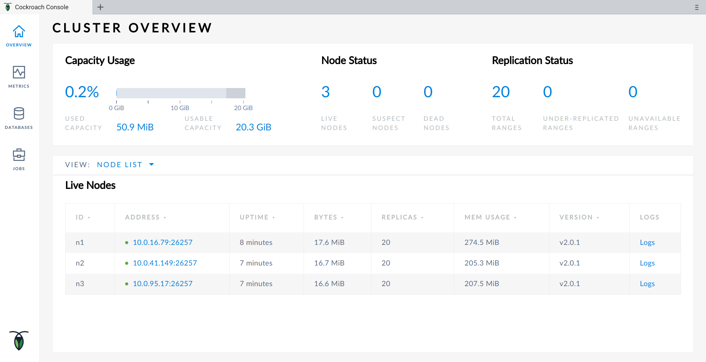

# Multi-AZ CockroachDB insecure cluster

Create and take down a multi-AZ CockroachDB 2.0.x _insecure_ cluster (3 nodes) with AWS TCP & HTTP load balancing. 

You will be able to access the web UI, the SQL cluster and each private cluster nodes through a jump server. 

## Steps

#### Pre-requisites

Install [awless](https://github.com/wallix/awless#why-awless)

Get the CockroachDB template directory (i.e. awless template + corresponding userdata) locally by cloning this repository:

        cd  ~/tmp
        git clone https://github.com/wallix/awless-templates

#### Run

Go into the CockroachDB template directory:

        cd awless-templates/cockroachdb

Verify where `awless` will deploy your infrastructure by displaying you current AWS region/profile with:

        awless switch

Run the template with `awless`:

        awless run cockroach_insecure_cluster.aws

Note that you will be prompted with _smart completion_ for any missing info. You will have time to review and confirm the template before running it.

Get an overview of the infrastructure you created:

        awless show cockroachdb-vpc --local

(Note the `--local` flag allows to look up cloud data synchronized locally by `awless` instead of fetching everything again remotely)

#### Play

You can now interact with the deployed infrastructure. For instance:

1. SSH connect to any of the cluster private nodes with `awless ssh` going through the proxy created as part of the template earlier:

    `awless list instances`  
    `awless ssh cockroachdb-node-1 --through jump-server` 

2. Retrieve the loadbalancer public DNS and connect to the cluster UI in a browser with http://{PUBLIC_DNS}:8080 . You can use `awless show cockroachdb-cluster --local` to get the value of the public DNS
  
3. Connect using sql to the cluster with (with a pre-installed cockroach binary) `cockroach sql --insecure --host {TCP_PUBLIC_DNS}`. Get the TCP load balancer public DNS with `awless show cockroachdb-cluster-tcp --local`.  

#### Tear down ... and stop paying!

When done, tear down the infrastructure completely with:

        awless log # to find the id of the previous awless run command        
        awless revert {id}

#### Notes

The template follows the recommended official deployment at https://www.cockroachlabs.com/docs/stable/deploy-cockroachdb-on-aws-insecure.html
